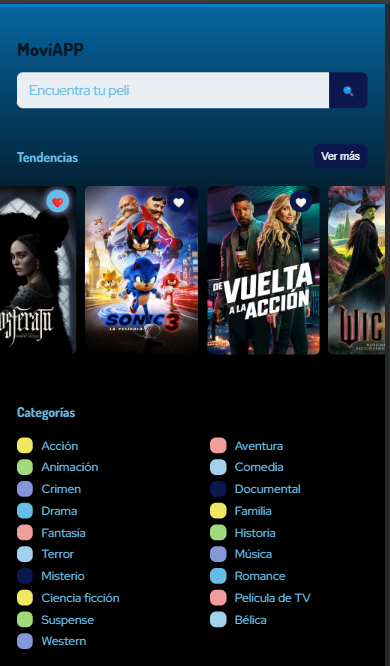
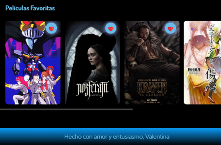

# 🎬 Movie App

Aplicación web desarrollada con JavaScript que consume una API de películas para mostrar contenido trending, categorías y detalles individuales.

🔗 **Demo:** https://vale1702.github.io/api-curso-2/  
💻 **Repositorio:** https://github.com/Vale1702/api-curso-2

---

## 🌟 Funcionalidades

- 🔍 Búsqueda de películas en tiempo real
- 🎬 Visualización de películas trending
- 📂 Exploración por categorías
- ❤️ Sistema de favoritos (almacenados en localStorage)
- 🔄 Navegación dinámica entre vistas
- 🖼️ Lazy loading de imágenes para mejorar rendimiento
- ♾️ Infinite scroll en secciones de películas

---

## 🛠️ Tecnologías

- JavaScript (Vanilla)
- CSS
- API REST (The Movie Database API)

---

## 📸 Vista previa




---

## 🚀 Cómo ejecutar el proyecto

1. Clona el repositorio:
```bash
git clone https://github.com/Vale1702/api-curso-2.git
```
Abre el archivo index.html en tu navegador


##  💡 Aprendizajes

En este proyecto trabajé en:

- Consumo de APIs y manejo de datos dinámicos
- Manipulación del DOM con JavaScript
- Optimización de carga con lazy loading
- Implementación de infinite scroll
- Manejo de estado con localStorage

## 🔧 Próximas mejoras
- 📱 Versión responsive
- 🎨 Rediseño con Tailwind CSS
- ⚡ Mejora de rendimiento y UX